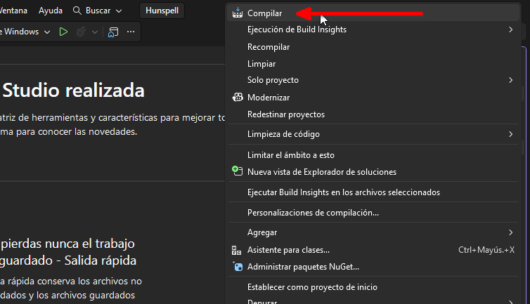

# Compilar Hunspell para Windows

Este documento explica cómo compilar `libhunspell-1.7-0.dll` desde el
código fuente ubicado en `third-party/hunspell/`, incluyendo
**libiconv** (necesario para diccionarios con codificaciones distintas
de UTF-8).

## Por qué libiconv es importante

Sin `libiconv`, la compilación termina exitosamente pero los
diccionarios que usan codificaciones como ISO-8859-1/2/15 (comunes en
diccionarios europeos) **fallan en runtime**. Los diccionarios de este
proyecto (`es_ES`, `en_US`) están en UTF-8, pero es mejor tener iconv
para compatibilidad con diccionarios adicionales que el usuario pueda
instalar.

> El propio README de Hunspell lo dice: *"Without
> mingw-w64-x86_64-libiconv the build still succeeds but the hunspell
> tool cannot convert between dictionary encodings, so any test or
> dictionary that declares a non-UTF-8 SET (e.g. ISO8859-1/2/15) will
> fail at runtime."*

## Requisitos

### 1. MSYS2

Descargar e instalar desde: https://www.msys2.org/

Se instala por defecto en `C:\msys64`.

### 2. Paquetes necesarios

Abrir la terminal **"MSYS2 MinGW64"** (icono azul en el menú inicio ---
NO la terminal blanca MSYS2 normal):

``` bash
# Actualizar el sistema primero
pacman -Syu

# Cerrar la terminal y reabrirla cuando lo pida

# Instalar herramientas de compilación + libiconv + gettext + autotools
pacman -S base-devel mingw-w64-x86_64-toolchain mingw-w64-x86_64-libtool \
          mingw-w64-x86_64-libiconv mingw-w64-x86_64-gettext autoconf automake
```

> **Nota:** Cuando pacman pregunte "Enter a selection (default=all):"
> para el toolchain, simplemente presiona **Enter** sin escribir nada.
> No escribas "all" como texto --- da error.

**Paquetes instalados:**

  ---------------------------------------------------------------------------
  Paquete                        Para qué sirve
  ------------------------------ --------------------------------------------
  `base-devel`                   make, patch, etc.

  `mingw-w64-x86_64-toolchain`   GCC, G++, linker para Windows 64-bit

  `mingw-w64-x86_64-libtool`     Generación de librerías compartidas (.dll)

  `mingw-w64-x86_64-libiconv`    **Conversión de codificaciones** (UTF-8 ↔
                                 ISO-8859, etc.)

  `mingw-w64-x86_64-gettext`     Internacionalización (NLS) --- incluye
                                 `autopoint`

  `autoconf`, `automake`         Generación de scripts configure (autotools)
  ---------------------------------------------------------------------------

## Pasos de compilación

### Con autotools (método recomendado --- igual que en Linux/macOS)

Según el README de Hunspell, el método estándar es autotools. Los
comandos son:

1.  **Abrir la terminal "MSYS2 MinGW64"** (icono azul)

2.  **Navegar al submódulo:**

    ``` bash
    cd /c/D/guitarchordstudio/third-party/hunspell
    ```

3.  **Generar los scripts de configure:**

    ``` bash
    autoreconf -vfi
    ```

4.  **Configurar el build:**

    ``` bash
    ./configure --prefix=/mingw64 --enable-shared --disable-static
    ```

    -   `--enable-shared` → genera la DLL
    -   `--disable-static` → no genera .lib estático
    -   `--prefix=/mingw64` → instala en el prefix de MinGW64

    **Verifica en la salida** que dice `iconv: yes`. Si dice
    `iconv: no`, el paquete `mingw-w64-x86_64-libiconv` no está
    instalado correctamente.

5.  **Compilar:**

    ``` bash
    make -j$(nproc)
    ```

    **Nota:** Es posible que `make` termine con un error en las
    herramientas de línea de comandos (`src/tools/`), algo como:

        make[3]: *** [Makefile:617: hunspell.o] Error 1

    **Esto no importa.** La librería `libhunspell-1.7-0.dll` ya fue
    compilada correctamente antes de ese error. Solo falla la
    compilación de los ejecutables `hunspell.exe`, `analyze.exe`, etc.,
    que no necesitamos. La DLL está en:

        src/hunspell/.libs/libhunspell-1.7-0.dll

6.  **Verificar que la DLL existe:**

    ``` bash
    ls -la src/hunspell/.libs/libhunspell-1.7-0.dll
    ```

7.  **Verificar que iconv se linkó correctamente:**

    ``` bash
    ldd src/hunspell/.libs/libhunspell-1.7-0.dll | grep iconv
    ```

    Debería mostrar algo como
    `libiconv-2.dll => /mingw64/bin/libiconv-2.dll`

8.  **Copiar las DLLs al proyecto:**

    ``` bash
    cp src/hunspell/.libs/libhunspell-1.7-0.dll /c/D/guitarchordstudio/resources/hunspell/
    cp /mingw64/bin/libiconv-2.dll /c/D/guitarchordstudio/resources/hunspell/
    cp /mingw64/bin/libgcc_s_seh-1.dll /c/D/guitarchordstudio/resources/hunspell/
    cp /mingw64/bin/libstdc++-6.dll /c/D/guitarchordstudio/resources/hunspell/
    ```

    **Nota:** Las DLLs de GCC y libstdc++ son necesarias porque MinGW
    las linkea dinámicamente. También necesitarás copiarlas junto al
    `.exe` cuando distribuyas con Nuitka.

## Verificar en Windows

Una vez copiada la DLL (y sus dependencias), verificar que ChordFlow la
detecta:

``` powershell
# En PowerShell de Windows (no MSYS2)
cd C:\D\guitarchordstudio
.\.venv\Scripts\Activate.ps1
python -c "from chordflow.spellcheck import SpellChecker; sc = SpellChecker('es_ES'); print(f'backend={sc.backend}')"
```

Debería imprimir `backend=hunspell` (en vez de `backend=dic`).

Para verificar que iconv funciona y las affix rules se procesan
correctamente:

``` powershell
python -c "
from chordflow.spellcheck import SpellChecker
sc = SpellChecker('es_ES')
print(f'backend={sc.backend}')
print(f'canta={sc.check(\"canta\")}')
print(f'vida={sc.check(\"vida\")}')
print(f'quiero={sc.check(\"quiero\")}')
"
```

Con el backend hunspell, "vida" y "quiero" deberían dar `True` (el motor
C++ de Hunspell procesa las affix rules completas).

## DLLs necesarias para distribución

Cuando compiles con Nuitka para distribuir el `.exe`, necesitarás
incluir estas DLLs en el mismo directorio que el ejecutable:

  -------------------------------------------------------------------------------------
  DLL                       Origen                     Necesaria
  ------------------------- -------------------------- --------------------------------
  `libhunspell-1.7-0.dll`   Compilada por ti           ✅ Sí

  `libiconv-2.dll`          `C:\msys64\mingw64\bin\`   ✅ Sí (para encodings no-UTF8)

  `libgcc_s_seh-1.dll`      `C:\msys64\mingw64\bin\`   ✅ Sí (runtime de GCC)

  `libstdc++-6.dll`         `C:\msys64\mingw64\bin\`   ✅ Sí (runtime de C++)
  -------------------------------------------------------------------------------------

El script `build/build-windows.bat` copia estas DLLs automáticamente
cuando están presentes en `resources/hunspell/`.

## Notas importantes

-   La terminal **MSYS2 MinGW64** (icono azul) es diferente de la
    terminal **MSYS2** normal (icono blanco).

    -   **MinGW64**: compila binarios Windows nativos (sin dependencia
        de MSYS2 runtime)
    -   **MSYS2 normal**: compila binarios que dependen de
        `msys-2.0.dll`

-   `autopoint` no es un paquete separado --- viene incluido en
    `mingw-w64-x86_64-gettext`.

-   **Falso positivo en VirusTotal / Windows Defender:** Es normal que
    `libhunspell-1.7-0.dll` compilada con MinGW sea detectada como
    `Trojan:Win32/Wacatac.B!ml` por Microsoft Defender (1 de 70 motores
    en VirusTotal). El sufijo `!ml` indica detección por machine
    learning, no por firma de malware conocido. Los otros 69 motores
    (Kaspersky, ESET, Bitdefender, Google, etc.) la reportan limpia.
    Esto es un falso positivo clásico de DLLs compiladas con GCC/MinGW
    que no tienen firma digital de Microsoft. Puedes verificar el hash
    SHA-256 en VirusTotal y comparar con tu build.

-   Para verificar qué DLLs necesita el hunspell compilado:

    ``` bash
    ldd src/hunspell/.libs/libhunspell-1.7-0.dll
    ```

## Compilar con Visual Studio (MSVC)

Esta es la opción que se comprobó en Windows durante el desarrollo. El
código fuente oficial de Hunspell 1.7.3 incluye una solución de Visual
Studio en `msvc/hunspell.sln`.

> **Importante:** para obtener una DLL hay que compilar la configuración
> **`Release_dll | x64`**. La configuración **`Release | x64`** genera
> la biblioteca estática `libhunspell.lib`, no `libhunspell.dll`.

### Requisitos

-   Visual Studio con la carga de trabajo **Desarrollo para el
    escritorio con C++** (*Desktop development with C++*).
-   Herramientas de compilación MSVC para x64/x86.
-   Windows SDK moderno.
-   En la prueba documentada se utilizó Visual Studio Community 2026
    Insiders, que ofreció actualizar el proyecto antiguo de Hunspell al
    toolset **v145** y al **Windows 11 SDK**.

### Paso 1. Abrir la solución

En Visual Studio:

1.  Ir a **Archivo \> Abrir \> Proyecto o solución**.
2.  Abrir:

``` text
C:\D\guitarchordstudio\third-party\hunspell\msvc\hunspell.sln
```

### Paso 2. Redestinar el proyecto antiguo

Hunspell 1.7.3 incluye archivos de proyecto creados para una versión
antigua de Visual Studio. Visual Studio moderno puede mostrar el
**Asistente para la instalación** indicando que el proyecto usa un
conjunto de herramientas antiguo (v140) y Windows SDK 8.1.

En el asistente:

1.  Seleccionar `libhunspell` para actualizar el conjunto de
    herramientas.
2.  Seleccionar también `libhunspell` para actualizar Windows SDK 8.1 al
    Windows 11 SDK.
3.  Pulsar **Aplicar**.


Las dos casillas de `libhunspell` deben quedar seleccionadas antes de
aplicar los cambios:


> No es necesario instalar Windows SDK 8.1 si Visual Studio permite
> redestinar el proyecto al SDK moderno ya instalado.

### Paso 3. Seleccionar la configuración que genera la DLL

En la barra superior de Visual Studio seleccionar:

``` text
Release_dll | x64
```

No utilizar:

``` text
Release | x64
```

si el objetivo es obtener la DLL. Esa configuración produce:

``` text
libhunspell.lib
```

La configuración `Release_dll` es la que define el proyecto como
biblioteca dinámica.

### Paso 4. Abrir el Explorador de soluciones

Si el panel no está visible, abrir:

**Ver \> Explorador de soluciones**

Atajo habitual:

``` text
Ctrl + Alt + L
```


En la solución deben aparecer proyectos como `hunspell`, `libhunspell` y
`testparser`.

### Paso 5. Compilar únicamente `libhunspell`

En el **Explorador de soluciones**, hacer clic derecho sobre:

``` text
libhunspell
```


En el menú contextual seleccionar:

**Compilar**



No es necesario compilar toda la solución si únicamente necesitamos la
biblioteca para cargarla desde Python/PyQt6.

### Paso 6. Localizar la DLL

Después de una compilación correcta con:

``` text
Release_dll | x64
```

buscar la salida de la configuración `Release_dll` dentro de:

``` text
third-party\hunspell\msvc\x64\
```

El nombre exacto observado en la compilación documentada fue:

``` text
libhunspell.dll
```

> Si únicamente aparece `libhunspell.lib`, se compiló `Release | x64`
> (biblioteca estática). Volver a Visual Studio, seleccionar
> **`Release_dll | x64`** y compilar otra vez `libhunspell`.

Para encontrarla rápidamente desde PowerShell:

``` powershell
Get-ChildItem C:\D\guitarchordstudio\third-party\hunspell\msvc -Recurse -Filter *.dll
```

### Paso 7. Copiar la DLL al proyecto

Crear el directorio de recursos si todavía no existe:

``` powershell
cd C:\D\guitarchordstudio
mkdir resources\hunspell -Force
```

Después copiar la DLL generada a `resources\hunspell\`.

El nombre final que espere el wrapper Python debe coincidir con el
nombre buscado por el código. Si el proyecto decide conservar el nombre
generado por MSVC:

``` text
resources\hunspell\libhunspell.dll
```

entonces el cargador Python debe contemplarlo explícitamente.

No renombres la DLL solamente para ocultar una discrepancia: mantén
sincronizados el nombre distribuido y la lista de nombres que busca el
loader.

### Paso 8. Comprobar la DLL con Python

Antes de integrarla completamente en la interfaz PyQt6, conviene
verificar que Windows puede cargarla:

``` powershell
python -c "import ctypes; ctypes.CDLL(r'resources\hunspell\libhunspell.dll'); print('DLL cargada correctamente')"
```

Después se deben probar las funciones Hunspell con un par `.aff` +
`.dic` real, incluyendo palabras correctas e incorrectas.

### Paso 9. Comprobación con VirusTotal

Como comprobación adicional de la DLL compilada, se analizó
`libhunspell.dll` en VirusTotal. En la prueba documentada, el resultado
fue **0/71 detecciones**.


Este resultado corresponde a esa compilación concreta y no sustituye las
buenas prácticas de seguridad ni garantiza que compilaciones futuras
produzcan el mismo hash o el mismo resultado.

### Notas sobre MSVC

-   La configuración correcta para una DLL en el proyecto oficial de
    Hunspell 1.7.3 es **`Release_dll`**, no `Release`.
-   `Release` produce una biblioteca estática `.lib`.
-   `Release_dll` produce la biblioteca dinámica que puede cargarse
    mediante `ctypes`.
-   **⚠️ Limitación importante: el proyecto MSVC de Hunspell NO incluye
    soporte para `libiconv`.** El archivo `msvc/libhunspell.vcxproj` no
    referencia iconv en los include paths ni en el linker. Esto significa
    que la DLL compilada con MSVC **no puede convertir entre encodings**
    — funcionará correctamente con diccionarios UTF-8 (como `es_ES` y
    `en_US` que vienen en este proyecto), pero diccionarios que usen
    ISO-8859-1/2/15 u otros encodings fallarán en runtime.
-   Si necesitas iconv con MSVC, tendrías que compilar `libiconv`
    separately y modificar manualmente el `.vcxproj` para agregar los
    include paths y linkear contra `libiconv.lib` — esto no está
    documentado aquí porque es significativamente más complejo.
-   Si Visual Studio muestra que el proyecto apunta a v140/Windows SDK
    8.1, puede redestinarse al toolset y SDK modernos.
-   Si aparece un error de archivos fuente o cabeceras faltantes y
    Hunspell está incluido como submódulo, comprobar:

``` bash
git submodule update --init --recursive
```

-   Para una aplicación Python/PyQt6, la DLL debe tener la misma
    arquitectura que Python. Si Python es de 64 bits, utilizar `x64`.

### ¿MinGW o MSVC? Cuál elegir

| Criterio | MinGW (MSYS2) | MSVC (Visual Studio) |
|----------|---------------|----------------------|
| **Soporte de iconv** | ✅ Incluido automáticamente | ❌ No incluido en el .vcxproj |
| **Diccionarios UTF-8** (es_ES, en_US) | ✅ Funciona | ✅ Funciona |
| **Diccionarios ISO-8859** | ✅ Funciona | ❌ Falla sin iconv |
| **Falsos positivos en Defender** | ⚠️ Frecuentes (`Wacatac.B!ml`) | ✅ Raros (0/71 en la prueba) |
| **DLLs adicionales necesarias** | 4 (hunspell + iconv + gcc + stdc++) | 1 (solo hunspell) |
| **Herramientas requeridas** | MSYS2 + pacman | Visual Studio |
| **Complejidad** | Media | Baja |

**Recomendación:** Si solo usas diccionarios UTF-8 (es_ES, en_US), **MSVC
es más simple** — una sola DLL, menos falsos positivos. Si necesitas
soporte para diccionarios con otros encodings, usa **MinGW**.

------------------------------------------------------------------------

## Solución de problemas

  -----------------------------------------------------------------------------------
  Error                                  Solución
  -------------------------------------- --------------------------------------------
  `autoreconf: command not found`        `pacman -S autoconf automake`

  `libtool: command not found`           `pacman -S mingw-w64-x86_64-libtool`

  `iconv.h: No such file`                `pacman -S mingw-w64-x86_64-libiconv`

  DLL no detectada por Python            Verificar que está en
                                         `resources/hunspell/libhunspell-1.7-0.dll`

  `libiconv-2.dll not found` al ejecutar Copiar
                                         `C:\msys64\mingw64\bin\libiconv-2.dll` al
                                         dir del exe

  El configure dice "iconv: no" en el    Asegurarse de usar MinGW64 terminal, no
  resumen                                MSYS2 normal

  `error: target not found: autopoint`   No existe como paquete --- viene dentro de
                                         `gettext`

  `make` falla en `src/tools/hunspell.o` No importa --- la DLL ya fue compilada en
                                         `src/hunspell/.libs/`

  Windows Defender detecta               Falso positivo clásico de MinGW --- 69/70
  `Trojan:Win32/Wacatac.B!ml`            motores en VirusTotal la reportan limpia

  `cannot find include file` en Visual   Ejecutar
  Studio                                 `git submodule update --init --recursive`

  MSVC dice "Platform x64 not found"     Instalar el workload "Desktop development
                                         with C++" en Visual Studio Installer

  MSVC: `libhunspell` project not found  Abrir `msvc/hunspell.sln`, no un archivo
                                         `.vcxproj` individual
  -----------------------------------------------------------------------------------

## Resumen rápido

### Opción A: MinGW (MSYS2)

``` bash
# 1. Abrir MSYS2 MinGW64 (icono azul)
# 2. Instalar dependencias (Enter en "default=all" sin escribir nada)
pacman -S base-devel mingw-w64-x86_64-toolchain mingw-w64-x86_64-libtool \
          mingw-w64-x86_64-libiconv mingw-w64-x86_64-gettext autoconf automake

# 3. Compilar
cd /c/D/guitarchordstudio/third-party/hunspell
autoreconf -vfi
./configure --prefix=/mingw64 --enable-shared --disable-static
make -j$(nproc)

# 4. Copiar DLLs al proyecto (4 DLLs)
cp src/hunspell/.libs/libhunspell-1.7-0.dll /c/D/guitarchordstudio/resources/hunspell/
cp /mingw64/bin/libiconv-2.dll /c/D/guitarchordstudio/resources/hunspell/
cp /mingw64/bin/libgcc_s_seh-1.dll /c/D/guitarchordstudio/resources/hunspell/
cp /mingw64/bin/libstdc++-6.dll /c/D/guitarchordstudio/resources/hunspell/
```

### Opción B: MSVC (Visual Studio)

``` powershell
# 1. Abrir en Visual Studio: third-party\hunspell\msvc\hunspell.sln
# 2. Redestinar libhunspell al toolset/Windows SDK modernos si Visual Studio lo solicita
# 3. Configuration: Release_dll, Platform: x64
# 4. Clic derecho en libhunspell > Compilar
# 5. Localizar libhunspell.dll en la salida Release_dll
cd C:\D\guitarchordstudio
mkdir resources\hunspell -Force
# Copiar la DLL generada a resources\hunspell manteniendo sincronizado
# su nombre con el loader Python.
```
